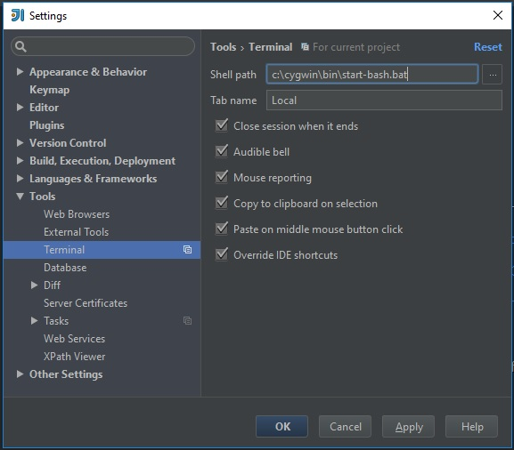
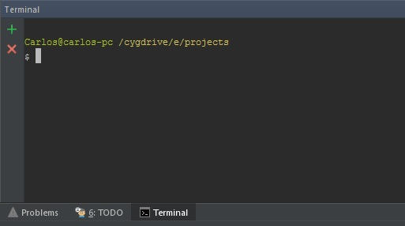

Para o intelliJ abrir um terminal bash corretamente no windows, crie um arquivo `.bat` com os seguintes comandos:

Se você instalou a versão 64 bits:

```bat c:\cygwin64\bin\start-bash.bat
@echo off
set CHERE_INVOKING=1 & c:\cygwin64\bin\bash.exe --login -i
```

Para versão 32 bits:

```bat c:\cygwin\bin\start-bash.bat
@echo off
set CHERE_INVOKING=1 & c:\cygwin\bin\bash.exe --login -i
```

## Configurar o intelliJ

No intelliJ, `File -> Setting -> Tools -> Terminal`, e altere o terminal para o arquivo que você criou:



Pronto, feche o terminal do intelliJ e abra novamente que já será o terminal bash.



## Bonus

O intelliJ não exibe corretamente comandos longos `git log` ou simplesmente o `vim`, para resolver isso, você só precisa adicionar uma variável no seu arquivo `.bash_profile`, pode ser na primeira linha mesmo.

```shell c:\cygwin64\home\voce.bash_profile OU c:\cygwin\home\voce.bash_profile
export TERM=cygwin
```

Fonte: [janzhou](https://janzhou.org/2015/06/integrating-cygwin-miktex-java-maven-and-intellij-idea-in-windows/)
