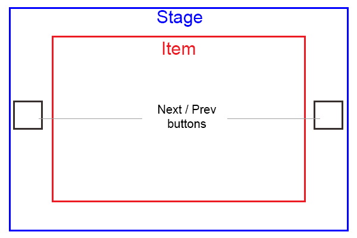

Existem vários plugins para jQuery, React e até mesmo Angular para criar um carrossel de imagens, mas é possível criar utilizando apenas CSS puro.

## Elementos de um carrossel



- **Stage**: A área disponível para o carrossel
- **Item**: O item visível atualmente pelo usuário
- **Next/Prev Buttons**: Os botões para passar aos items anteriores/próximos, que normalmente estão ocultos

<!-- more -->

### Updates:

- 2021-01-25
  - movido código para CodeSandbox
  - revisão do texto do post
  - grande redução no código fonte

## Conceito

Vamos utilizar inputs do tipo `radio`, que estarão ocultos para os usuários, em conjunto com a tag `label` com o atributo `for=""`, que ao ser clicada, automaticamente checa um radio que tenha o id correspondente.

Todos os input radio terão o mesmo atributo `name`, assim o próprio navegador se encarrega de desmarcar e marcar os radios sem a necessidade de JavaScript.

## Estrutura HTML do carrossel de images

Utilizaremos 4 inputs do tipo rádio pra controlar 4 imagens no carrossel.
Repare que o primeiro item não tem o botão "anterior" e o último não tem o botão "próximo".

```html
<section class="carousel">
  <input type="radio" name="carousel" id="carousel1" checked="checked" />
  <input type="radio" name="carousel" id="carousel2" />
  <input type="radio" name="carousel" id="carousel3" />
  <input type="radio" name="carousel" id="carousel4" />

  <main class="carousel__stage">
    <aside class="carousel__item">
      
      <label for="carousel2" class="carousel__next carousel__control"></label>
    </aside>

    <aside class="carousel__item">
      <label for="carousel1" class="carousel__prev carousel__control"></label>
      
      <label for="carousel3" class="carousel__next carousel__control"></label>
    </aside>

    <aside class="carousel__item">
      <label for="carousel2" class="carousel__prev carousel__control"></label>
      
      <label for="carousel4" class="carousel__next carousel__control"></label>
    </aside>

    <aside class="carousel__item">
      <label for="carousel3" class="carousel__prev carousel__control"></label>
      
    </aside>
  </main>
</section>
```

A primeira coisa que precisamos fazer é ocultar os inputs para o usuário.
Será utilizada a técnica de mover o elemento para fora do viewport, pois alguns navegadores tratam inputs "ocultos" como estando desabilitados.  
Desta maneira o input fica invisível, mas ainda é um elemento válido para os navegadores.

```css
.carousel input {
  position: absolute;
  left: -10000px;
}
```

Vamos deixar o carrossel responsivo:

```css
.carousel {
  width: 80%;
  height: 80%;
  margin: 0 auto;
}

.carousel__stage {
  overflow: hidden;
  font-size: 0;
  white-space: nowrap;
  width: 100%;
  height: 100%;
  transition: text-indent 500ms;
  position: relative;
}

.carousel__item {
  display: inline-block;
  text-indent: 0;
  width: 100%;
  height: 100%;
}

.carousel__image {
  width: 100%;
  height: 100%;
  object-fit: cover;
}
```

Posicionamento dos botões Próximo / Anterior. Repare que o elemento stage é quem tem posicionamento relative, então todos os botões serão alinhados a ele.  
Como os botões terão sua visibilidade oculta por padrão, ao movimentarmos de um item para o outro, vamos exibir os botões corretamente, dando uma ilusão para o usuário que o botão não mudou.

```css
.carousel__control {
  display: none;
  position: absolute;
  top: 50%;
  color: #fff;
  background: rgba(255, 255, 255, 0.3);
  z-index: 1;
  font-size: 1rem;
  padding: 20px;
  cursor: pointer;
}

.carousel__prev {
  left: 0;
}

.carousel__prev::after {
  content: ' << ';
  display: inline-block;
}

.carousel__next {
  right: 0;
}

.carousel__next::after {
  content: ' >> ';
  display: inline-block;
}
```

Agora é aonde a mágica começa.

Será utilizado o seletor **:checked** do css para sabermos qual é o input radio que está selecionado no momento.

Utilizando a propriedade `text-indent` do CSS é possível movimentarmos o stage e dar a impressão de animação.

Nesta etapa temos que fazer um seletor para cada "estado" da animação:

```css
#carousel1:checked ~ .carousel__stage {
  text-indent: 0;
}

#carousel2:checked ~ .carousel__stage {
  text-indent: -100%;
}

#carousel3:checked ~ .carousel__stage {
  text-indent: -200%;
}

#carousel4:checked ~ .carousel__stage {
  text-indent: -300%;
}
```

Para finalizar, vamos fazer a mágica de só mostrar os botões `Próximo / Anterior` referentes ao item atual no stage:

```css
#carousel1:checked
  ~ .carousel__stage
  .carousel__item:nth-child(1)
  .carousel__control,
#carousel2:checked
  ~ .carousel__stage
  .carousel__item:nth-child(2)
  .carousel__control,
#carousel3:checked
  ~ .carousel__stage
  .carousel__item:nth-child(3)
  .carousel__control,
#carousel4:checked
  ~ .carousel__stage
  .carousel__item:nth-child(4)
  .carousel__control {
  display: block;
}
```

## Resultado final

<iframe src="https://codesandbox.io/embed/carousel-with-css-only-nshhx?autoresize=1&fontsize=14&hidenavigation=1&theme=dark&view=preview"
  style="width:100%; height:500px; border:0; border-radius: 4px; overflow:hidden;"
  title="carousel with CSS only"
  allow="accelerometer; ambient-light-sensor; camera; encrypted-media; geolocation; gyroscope; hid; microphone; midi; payment; usb; vr; xr-spatial-tracking"
  sandbox="allow-forms allow-modals allow-popups allow-presentation allow-same-origin allow-scripts"
></iframe>

Você pode conferir o código fonte do exemplo aqui:  
https://codesandbox.io/s/carousel-with-css-only-nshhx
