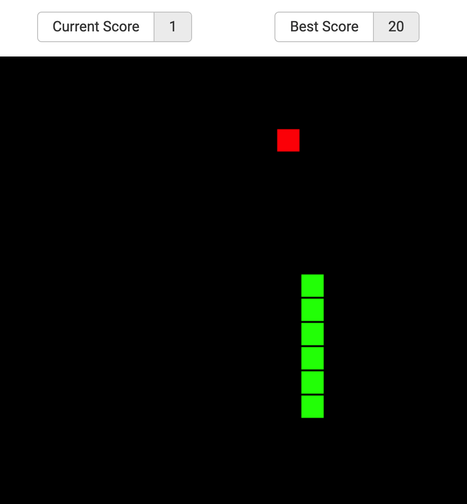
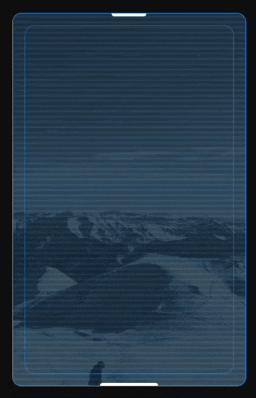
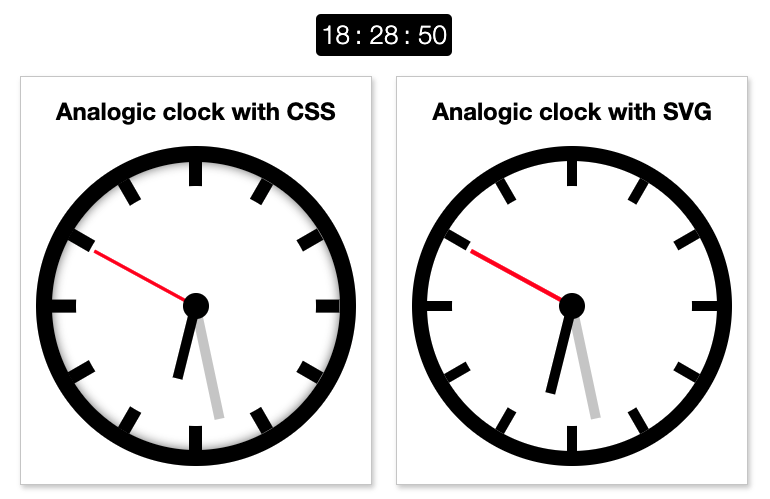

<div class="article-entry experiments-page">

  <style>
    .experiments-page {
      img {
        width: auto;
        height: auto;
        margin: 0 auto;
      }

      img[alt="Snake game screenshot"] {
        max-height: 600px;
      }
    }
  </style>

# Experiments With CSS, JavaScript and DevOPS

## Snake Game

A clone of the famous snake game before smartphones were a thing.  
You can play it in the [live-version here](https://carlos-algms.github.io/snake-game/)



[snake-game sources](https://github.com/carlos-algms/snake-game)

## Animated Screen effect with CSS only

<a href="animated-screen/">Check the live version here</a>

<a href="animated-screen/">
  <figure style="background-color: rgb(15, 15, 15)">



  </figure>
</a>

## Multiple-clocks

Create an animated clock with different technologies, like with CSS and with SVG + JavaScript

Live version: https://multiple-clocks.vercel.app/



[Multiple-clocks sources](https://github.com/carlos-algms/multiple-clocks)

## CSS flex-layout

The idea was to create a tiny framework based on css flex-box to manage grids without flooding the html.  
Once one defines a `container` everything inside it is turn into a column, greatly reducing the amount of tags needed.

It is published as an npm package [here](https://www.npmjs.com/package/@webdev-tools/css-flex-layout) and can be installed as:

```shell
npm i @webdev-tools/css-flex-layout
```

Usage:

```html
<section class="fl-3-cols-container">
  <aside>001</aside>
  <aside>002</aside>
  <aside>003</aside>
  <!-- breaks to next line -->
  <aside>004</aside>
  <aside>005</aside>
  <aside>006</aside>
  <!-- breaks to next line -->
  <aside>007</aside>
  <!-- alone on the last line -->
</section>
```

[CSS flex-layout sources](https://github.com/webdev-tools/css-flex-layout)

</div>
